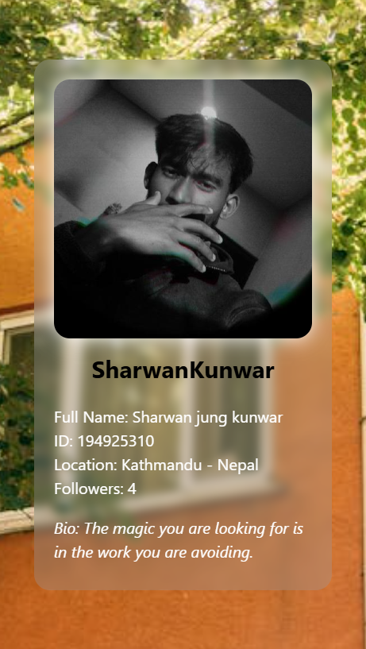

# GitHub Profile Card (React + TailwindCSS)

This project fetches and displays GitHub user information using a custom React hook and styles the output using TailwindCSS. The app shows a profile card with an avatar and user details like username, name, ID, location, followers, and bio.

## 🛠 Tech Stack

- **React.js**
- **TailwindCSS**
- **GitHub API**
- **Custom React Hooks**

---

## 🚀 Features

- Fetches user data from GitHub using a username.
- Custom hook for modular API fetching (`useGithubData`)
- Responsive card UI with:
  - Profile picture
  - Username
  - Full name
  - GitHub ID
  - Location
  - Followers count
  - Bio (at the end)
- Glassmorphism card design with backdrop blur and white drop-shadow
---


## 🧠 How it Works

### Custom Hook (`useGithubData.js`)

```js
function useGithubData(userName) {
  const [data, setData] = useState(null);

  useEffect(() => {
    fetch(`https://api.github.com/users/${userName}`)
      .then((res) => res.json())
      .then((data) => setData(data));
  }, [userName]);

  return data;
}
```
## preview in big screen


## Preview in small screen



### you can further style


### 🧠 Moral of the Story

Every bug fixed, every error solved, and every line of code improved is a step forward in becoming a better developer.  
This project reminded me that real growth happens when I face issues head-on, ask questions, and stay curious.  
From making a custom hook to polishing UI with Tailwind, this small project turned into a big lesson in **patience**, **problem-solving**, and **persistence**.

